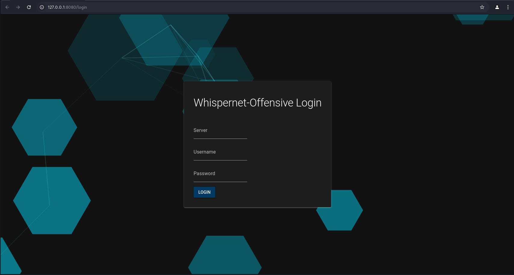

# Commands

## General

### **`help`**
| **Description** | Prints the `help` command, which displays all available commands. |
|----------------|---------------------------------------------------------------|
| **Arguments**  | None                                                           |
| **Example**    | `help`                                                         |
| **Screenshot** |                   |

---

### `ExampleCommand`
| **Description** | ExampleCommand |
|----------------|----------------|
| **Arguments**  | `<pid> <file>`  |
| **Example**    | `examplecommand 1234 somefile.dll` |
| **Screenshot** |  |

