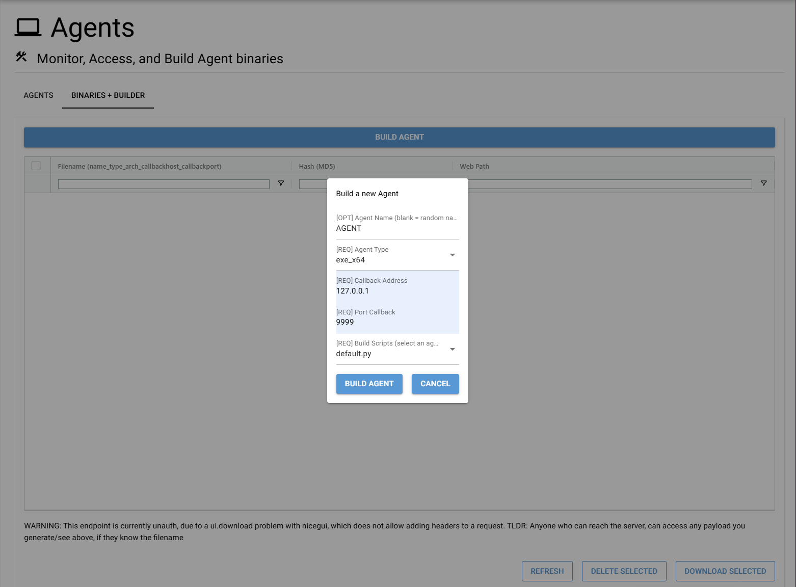
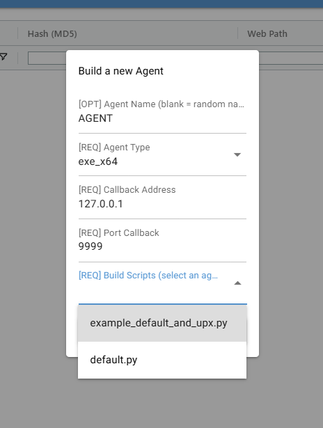
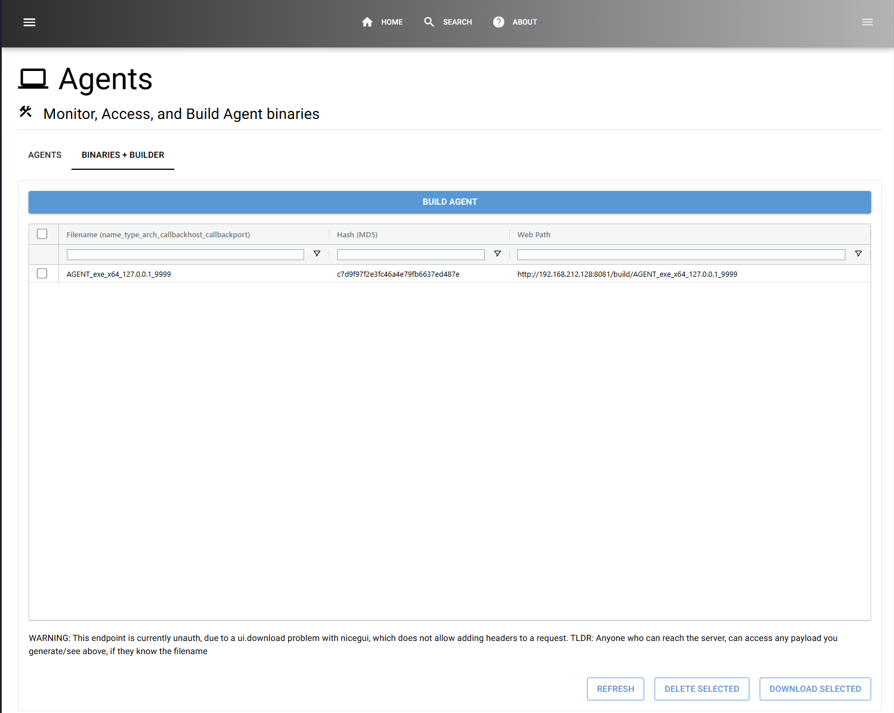

# Agents

## Overview
WhisperNet Agents are the core components responsible for executing commands, retrieving data, and maintaining remote access to target systems. Unlike traditional RATs (Remote Access Trojans), WhisperNet Agents emphasize modularity, stealth, and operational security.

## Types of Agents
WhisperNet supports multiple Agent types, each tailored for different operational needs.

| Agent Type       | Format  | Execution Method                               | Notes |
|------------------|---------|-----------------------------------------------|-------|
| Standard Agent   | `.EXE`  | `Agent.exe`                                   | Standalone execution |
| DLL Agent       | `.DLL`  | `rundll32 Agent.dll, Start`                   | Loadable via `rundll32` |
| Custom Agent    | `.EXE/.DLL` | Varies per configuration                    | Fully customizable/built it yourself |


## Building Agents
### Modular CMake-Based System
WhisperNet Agents leverage a CMake-based build system, ensuring:

- **Cross-Platform Support**: Easily compile Agents for Windows, Linux, and other platforms.
- **Extensibility**: Modify core behavior without changing the foundational codebase.
- **Reproducibility**: Consistent, structured builds for deployment.

Luckily, the server handles most of the building for you, but the option is there (CMAKE) to do it manually if you'd like. See [Manual Builds](### Manual Agent Building)

### Web Interface

The web interface allows for an automated/easier build options that doing it all manually.



#### Build Options:

##### Agent Name
(Optional) The name of the binary after it is built.

If left blank, the generated format will be:

`RANDOM_NAME_architecture_CallbackAddress_CallbackPort.FileExtension`

I figured this makes it easier to track which Agent does what/talks to where.


---

##### Agent Type

The type of Agent

| Agent Type/Name             | Executable/Output Formats |  Notes | Running|
|--------------------------------|------------------|-----------|-----------|
|Standard Agent (exe_x64) | **.EXE**      | Bog standard EXE Agent      | Command: `.\Agent.exe` |
|Standard Agent (dll_x64) | **.DLL**        | Same as EXE Agent, but in DLL form | Entry Point Function: `Start`<br> Command: `rundll32.exe Agent.dll, Start`|

---
NOTE: In the future, the `CallbackAddress` and `CallbackPort` options will be replaced by a "listener" dropdown, to select a listener to communicate with.

##### Agent Callback Address

The address the Agent will callback to.

Ex: `1.1.1.1`

---

##### Agent Callback Port

The port the Agent will callback to.

Ex: `9999`


---


##### Custom Configuration Scripts
The config script used to modify the Agent. These are located at `<name_of_Agent>/scripts`


| Agent Type/Name             | Script                                |  Short Description | 
|--------------------------------|------------------------------------------------------|-----------|
|Standard Agent (exe_x64) | `default.py`    | The default configure script. XOR's strings, etc.     | 
|Standard Agent (dll_x64) | `default.py`    | The default configure script. XOR's strings, etc.     | 



---

### Building the Agent

After you've filled in all the relevant details, click `Build Agent`. This will start the build process on the server

After a few seconds, hit the `refresh` button in the bottom right, and you should see the newly built Agent!



---


# **Manual Agent Building Guide**  
For when you're feeling brave or the web interface isn't cooperating.

---

## **Step 1: Copy the Agent Directory**  
Create a manual copy of the Agent you want to build:  

The Agents are located at `<project_root>/server/data/Agent_templates`

```bash
cp -r exe_x64 exe_x64_manual
```
---

## **Step 2: Run the Configure Script**  
Navigate into the new directory and run the configuration script:  

```bash
cd exe_x64_manual
python3 configure.py
```

This may ask for options, if so, fill them in:
```
└─$ python3 configure.py
WARNING: By nature... these values are injectable. Don't be stupid, stick to the examples.
[REQ] Enter the Agent name: MyAgent
[REQ] Enter the callback address (Ex: '1.1.1.1', 'somedomain.com') (do NOT include the '): 1.1.1.1
[REQ] Enter the callback port (Ex: 9999): 9999

```


To use a different script, copy a script from the `scripts` folder, into the Agent folder:  
 - *Scripts are located in each Agent's `scripts` folder.*  

```bash
cp ./scripts/my_configure_script.py ./configure.py
python3 configure.py
```

NOTE: These are one-shot scripts. Once an Agent has been configured with a script, it cannot be re-configued. You will need to re-copy the Agent and re-run the script to reconfigure.

---

## **Step 3: Create & Enter the Build Directory**  

```bash
mkdir ./build && cd ./build
```
---

## **Step 4: Run CMake Configure**  

```bash
cmake ..
```
---

## **Step 5: Build the Agent**  

```bash
cmake --build .
```
---

## **Step 6: Locate the Compiled Binary**  
If everything went well, you’ll find the compiled Agent here:  

```bash
exe_x64_manual/build/bin/someagentname.exe
```

*Done! Your manually built Agent is ready to go.*  
