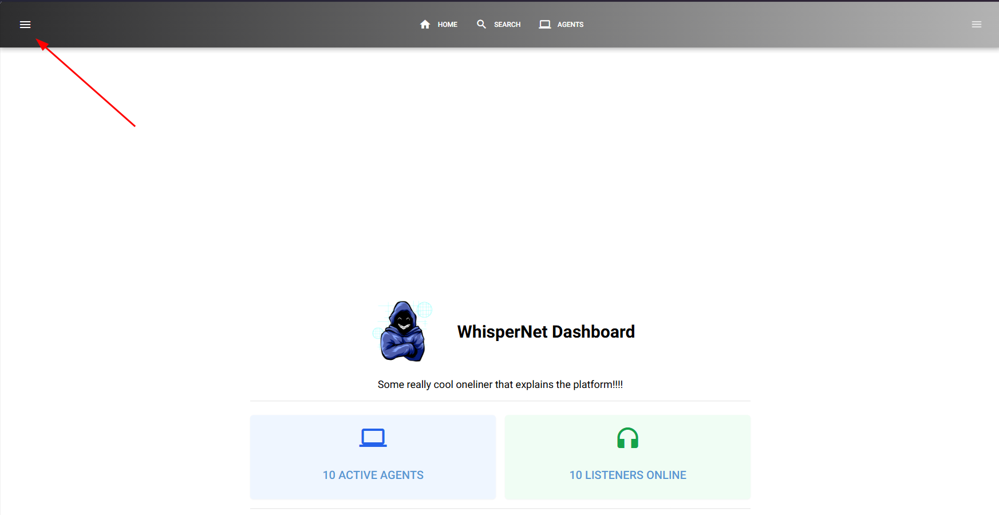

# **Home Page Overview**  

The **Home Page** is the first screen you see after a successful login. It serves as the main dashboard, providing key statistics and navigation options for managing agents and listeners.  

---

## **1. Features**  

### **1.1 Stats Board**  

The **Stats Board** provides an overview of essential system metrics, including:  

- **Active Agents** – Displays the current number of online agents.  
- **Active Listeners** – Shows the number of currently running listeners.  

Both of these are clickable links, click either the "X Active Agents" or "X Listeners Online" to be taken to the Agents, or Listeners page, respectively

---

## **2. Navigation**  

### **2.1 Navigation Bar (Top Menu)**  

Located at the top of the interface, the **Navigation Bar** provides quick access to the most frequently used sections:  

- **Home** – Returns to the main dashboard.  
- **Search** – Allows users to find agents, logs, or other relevant data.  
- **Agents** – Displays a list of all registered agents.  

### **2.2 Sidebar Drawer (Expanded Menu)**  

For additional navigation, click the **hamburger icon** in the top left corner to open the **Drawer Menu**.  

- This menu contains **all available sections** that were not included in the top navigation bar.  
- It provides access to **less frequently used features** while keeping the main interface clean and efficient.  

---
