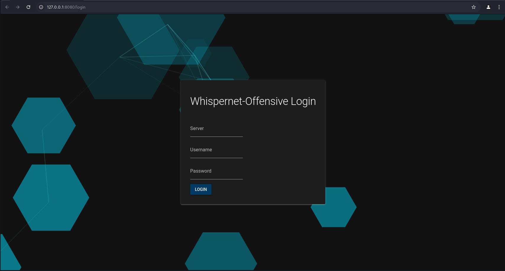

#  WhisperNet C2 Server

Welcome to the WhisperNet C2 server! This project is currently in active development, and features, functionalities, and APIs may change. Please check back regularly for updates! 

## Table of Contents

- [Features](#features)
- [Plugins](#plugins)
- [Installation](#installation)
- [Basic Usage](#usage)
- [Contributing](#contributing)
- [License](#license)
- [Disclaimer](#disclaimer)

## Key Goals N motivation/FAQ:

Why did I make this?:


What makes it different/what's it supposed to be good at:


## Features

- **Plugins!**: Plugins are the meat and potatoes of this entire project, see the [Plugins](#plugins) section for more info.

## Plugins

Plugins allow for extensibiility to WhisperNet

- **[Plugin Name]**: Brief description of what this plugin does.

## Installation

### First, Clone the repository:

   ```bash
   git clone https://github.com/ryanq47/WhisperNet-Offensive.git
   ```


### Then, follow the quickstart guides:

**Server Quickstart**:  
   `Documentation/docs/Server/Quick_Start.md`

**Web Interface Quickstart**:  
   `Documentation/docs/Web_Interface/Quick_Start.md`

Alternatively, you can find these guides in the README files located in the `Server` and `WebInterface` directories.


## Usage

Once you've done the Quickstarts, you should be able to access the WebInterface, at `http://127.0.0.1:8080`, or whatever you set the IP/PORT to.

On success, you should see this screen:




## Next Steps:

If you haven't started the server yet, go do that. From here, go ahead and login, and check out the WebInterface documentation for how to use everything
